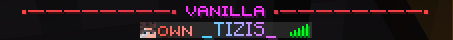

# 🎨 Цветной никнейм

После покупки "Цветного никнейма" у вас появится возможность вводить команду `/name` , она не требует аргументов.

## Использование

Прописав команду, у вас откроется меню.

<figure><figcaption></figcaption></figure>

### Градиентный никнейм

Нажав на эту кнопку, вы откроете меню для заполнения кодов цветов. Вы можете подставить любой цвет в формате `#XXXXXX` или `XXX, XXX, XXX`. Для тестирования градиентов вы можете использовать инструмент [BirdFlop](https://www.birdflop.com/resources/rgb/).

<figure><figcaption>
Пример градиента
</figcaption></figure>

### Одноцветный никнейм

Нажав на эту кнопку, вы откроете меню с выбором цвета, только для одного. Поле принимает значения в формате `#XXXXXX` или `XXX, XXX, XXX`. Для тестирования цвета на вашем никнейме вы можете использовать инструмент [BirdFlop](https://www.birdflop.com/resources/rgb/).

<figure><figcaption>
Пример одноцветного никнейма
</figcaption></figure>
