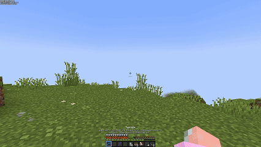

# 📘 Палочка отладки и 3D модели

#### Думаю, каждый из вас хотел бы поставить 3D модели прямо в майнкрафте. На нашем сервере - эта проблема решаема!


## Как создать палочку отладки?

В крафте палочки отладки используется 2 зачарованной книги: Шёлковое касание и Бесконечность. Их порядок неважен.

<figure><figcaption></figcaption></figure>

## Как пользоваться палочкой отладки?

### _Основное_

Чтобы использовать ее по назначению, достаточно просто кликнуть <kbd>SHIFT</kbd> + <kbd>ПКМ</kbd> с **кусочком глины** по блоку, который нужно отредактировать. После, у этого блока можно будет менять практически все NBT-теги.

Чтобы снять глину, достаточно кликнуть <kbd>SHIFT</kbd> + <kbd>ПКМ</kbd> по намазанному блоку с любым топором в руке.

### _Продвинутое_

* Нажмите <kbd>Q</kbd> по палочке с любым предметом в левой руке, чтобы поставить его как 2D модель.
* Нажмите <kbd>SHIFT</kbd> + <kbd>Q</kbd> по палочке с любым предметом в левой руке, чтобы поставить его как 3D модель.
* Нажмите <kbd>F</kbd> чтобы открыть настройки палочки отладки.

## Как скрафтить чертеж для моделей?

<figure><figcaption></figcaption></figure>

## Как поставить 3D модель?

### Создание модели

Перейдите на сайт [**https://block-display.com/bdengine/**](https://block-display.com/bdengine/), создайте модель из предложенных блоков и нажмите "export to minecraft", скопируйте команду и не редактируя ее, распределите по чертежу.

Пример, как должна выглядить команда:


```json
/summon block_display ~-0.5 ~-0.5 ~-0.5 {Passengers:[{id:"minecraft:block_display",block_state:{Name:"minecraft:cauldron",Properties:{}},transformation:[0.75f,0f,0f,0.125f,0f,0.25f,0f,0.125f,0f,0f,1f,0f,0f,0f,0f,1f]},{id:"minecraft:block_display",block_state:{Name:"minecraft:cauldron",Properties:{}},transformation:[0.75f,0f,0f,0.125f,0f,0.25f,0f,0.625f,0f,0f,1f,0f,0f,0f,0f,1f]},{id:"minecraft:block_display",block_state:{Name:"minecraft:polished_blackstone_button",Properties:{face:"ceiling",facing:"east",powered:"false"}},transformation:[0f,1f,0f,0f,-1f,0f,0f,0.625f,0f,0f,0.625f,-0.1328f,0f,0f,0f,1f]},{id:"minecraft:block_display",block_state:{Name:"minecraft:polished_blackstone_button",Properties:{face:"ceiling",facing:"east",powered:"false"}},transformation:[0f,1f,0f,-0.875f,-1f,0f,0f,0.625f,0f,0f,0.625f,-0.1328f,0f,0f,0f,1f]},{id:"minecraft:block_display",block_state:{Name:"minecraft:polished_blackstone_button",Properties:{face:"ceiling",facing:"east",powered:"false"}},transformation:[0f,1f,0f,-0.875f,-1f,0f,0f,0.625f,0f,0f,0.625f,0.4922f,0f,0f,0f,1f]},{id:"minecraft:block_display",block_state:{Name:"minecraft:polished_blackstone_button",Properties:{face:"ceiling",facing:"east",powered:"false"}},transformation:[0f,1f,0f,0f,-1f,0f,0f,0.625f,0f,0f,0.625f,0.4922f,0f,0f,0f,1f]},{id:"minecraft:block_display",block_state:{Name:"minecraft:light_gray_candle",Properties:{candles:"1",lit:"false"}},transformation:[0.4375f,0f,0f,0.6875f,0f,1.6875f,0f,0.1875f,0f,0f,1f,-0.3125f,0f,0f,0f,1f]},{id:"minecraft:block_display",block_state:{Name:"minecraft:light_gray_candle",Properties:{candles:"1",lit:"false"}},transformation:[0.5625f,0f,0f,0.625f,0f,1.6875f,0f,0.1875f,0f,0f,1f,0.3125f,0f,0f,0f,1f]},{id:"minecraft:block_display",block_state:{Name:"minecraft:light_gray_candle",Properties:{candles:"1",lit:"false"}},transformation:[0.5625f,0f,0f,-0.1875f,0f,1.6875f,0f,0.1875f,0f,0f,1f,0.3125f,0f,0f,0f,1f]},{id:"minecraft:block_display",block_state:{Name:"minecraft:light_gray_candle",Properties:{candles:"1",lit:"false"}},transformation:[0.5625f,0f,0f,-0.1875f,0f,1.6875f,0f,0.1875f,0f,0f,1f,-0.3125f,0f,0f,0f,1f]},{id:"minecraft:block_display",block_state:{Name:"minecraft:light_gray_candle",Properties:{candles:"1",lit:"false"}},transformation:[0.5f,0f,0f,0.6563f,0f,0f,-1f,1.375f,0f,1f,0f,0.125f,0f,0f,0f,1f]},{id:"minecraft:block_display",block_state:{Name:"minecraft:light_gray_candle",Properties:{candles:"1",lit:"false"}},transformation:[-0.5f,0f,0f,1.1563f,0f,0f,-1f,1.375f,0f,-1f,0f,0.875f,0f,0f,0f,1f]},{id:"minecraft:block_display",block_state:{Name:"minecraft:light_gray_candle",Properties:{candles:"1",lit:"false"}},transformation:[0.5f,0f,0f,-0.1563f,0f,0f,1f,0.375f,0f,-1f,0f,0.875f,0f,0f,0f,1f]},{id:"minecraft:block_display",block_state:{Name:"minecraft:light_gray_candle",Properties:{candles:"1",lit:"false"}},transformation:[0.5f,0f,0f,-0.1563f,0f,0f,-1f,1.375f,0f,1f,0f,0.125f,0f,0f,0f,1f]},{id:"minecraft:item_display",item:{id:"minecraft:book",Count:1},item_display:"none",transformation:[0.625f,0f,0f,0.4375f,0f,0.5433f,0.2588f,0.4375f,0f,-0.1456f,0.9659f,0.1875f,0f,0f,0f,1f]},{id:"minecraft:item_display",item:{id:"minecraft:book",Count:1},item_display:"none",transformation:[-0.625f,0f,0f,0.4375f,0f,0.4871f,-0.5f,0.4375f,0f,-0.2812f,-0.866f,0.3125f,0f,0f,0f,1f]},{id:"minecraft:item_display",item:{id:"minecraft:writable_book",Count:1},item_display:"none",transformation:[0.5409f,-0.1363f,0.1294f,0.4375f,-0.0377f,0.1406f,0.9659f,0.8125f,-0.1499f,-0.5273f,0.2241f,0.375f,0f,0f,0f,1f]}]}
```



### Установка модели

Распределите команду по всему чертежу не добавляя ничего лишнего. Не обязательно заполнять всю страницу прежде чем переходить на новую, можете хоть по символу на страницу. Главное, чтобы не было лишних знаков по типу пробела.

Теперь, возьмите чертеж в левую руку, а палочку  отладки в правую. Нажмите <kbd>SHIFT</kbd> + <kbd>ПКМ</kbd> по воздуху и чертеж появится в вашем курсоре.

Разместите чертеж в необходимое место и нажмите <kbd>ПКМ</kbd>.

С вашего инвентаря будут взяты ресурсы, которые вы использовали при создании модели. Если ресурсов не будет хватать, создание модели автоматически отменится и в чате отобразятся нужные для установки ресурсы.

<figure><figcaption></figcaption></figure>

## Управление моделью

Нажмите <kbd>F</kbd> с палочкой отладки в руке. Открыв меню, вам предоставится возможность выбора действий.

### Удаление модели

В открывшемся меню нажмите кнопку "УДАЛЕНИЕ МОДЕЛИ". Наведитесь на нужную часть модели(она выделится красной обводкой) и нажмите любую клавишу мыши.

### Блокировка/Разблокировка модели

В открывшемся меню нажмите кнопку "ЗАБЛОКИРОВАТЬ РЕДАКТИРОВАНИЕ МОДЕЛИ". Наведитесь на нужную часть модели(она выделится красной обводкой) и нажмите любую клавишу мыши. В чате высветится, что вы сделали с моделью. По умолчанию, установка модели автоматически блокирует ее редактирование другим игрокам.

## Как вернуться к обычному дебаг стику?

Откройте меню палочки клавишей <kbd>F</kbd> и нажмите кнопку "ПЕРЕКЛЮЧИТЬСЯ НА ОБЫЧНЫЙ ДЕБАГ СТИК". Теперь, вы можете пользоваться палочкой отладки как обычно, присыпая блоки глиной и редактируя их.
