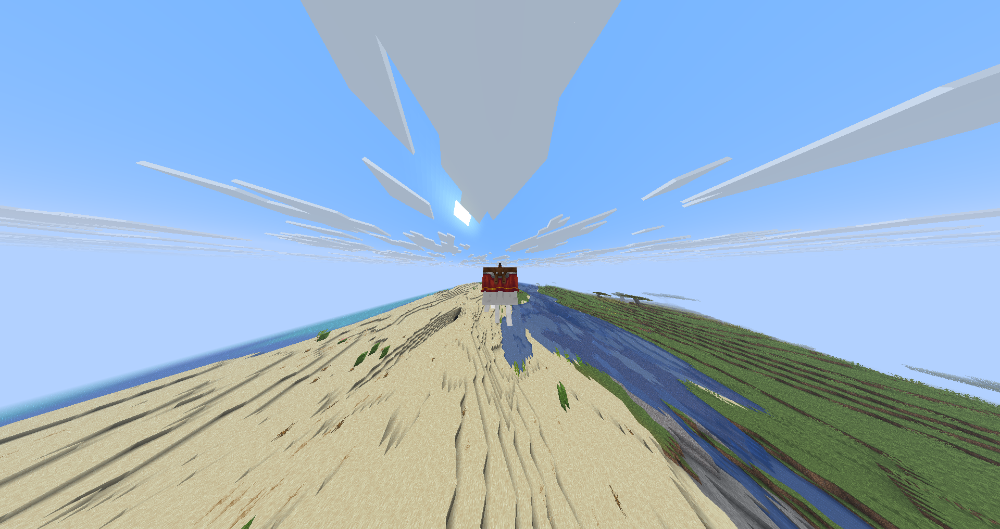

# 💣 Счастливые гасты

## Прокачка Счастливых Гастов

Счастливых гастов можно прокачивать с помощью [Универсального сборщика](assembler.md)**.** После прокачки гаст становится значительно функциональнее и мощнее.

***

## Использование динамита

После того, как гаст прокачан, в него можно загрузить до **трёх стаков динамита**. Для этого нужно:

* Подойти к гасту и открыть его инвентарь, нажав клавишу <kbd>F</kbd> (это откроет интерфейс гаста, где можно класть предметы).
* В инвентаре гаста есть всего 3 слота, в которые можно положить динамит.

### Сброс динамита

Для того, чтобы сбросить динамит из гаста, необходимо:

1. Взять в руку любой предмет (важно — не обязательно динамит, можно любой). Не переживайте, предмет не исчезнет и не вылетит из вашего инвентаря.
2. Нажимать кнопку <kbd>Q</kbd>, чтобы сбросить по одному динамиту из гаста.

<figure><figcaption></figcaption></figure>

## Поле зрения при езде на гасте

Когда Вы садитесь на любого гаста — прокачанного или нет — у вас автоматически увеличивается поле зрения (FoV, field of view). Это сделано для удобства и лучшего обзора вокруг.

* Увеличенное поле зрения помогает видеть больше территории, что особенно удобно при передвижении по миру.
* После того, как Вы слезаете с гаста, поле зрения возвращается к обычным настройкам.


Если у Вас уже установлен высокий FoV в настройках игры, эффект складывается — при езде на гасте поле зрения станет **очень большим**, что возможно испортит вам игру.


<figure><figcaption></figcaption></figure>

## Кормление гастов

Чтобы восстанавливать здоровье гастам, можно кормить двумя видами предметов:

* **Молоко** — восстанавливает 3 единицы здоровья гаста (полтора сердечка).
* **Костная мука** — восстанавливает 1 единицу здоровья (пол сердечка).

## Взаимодействие с гастом — поглаживание

Вы можете погладить гаста, нажав <kbd>SHIFT</kbd> **+** <kbd>ПКМ</kbd> по нему. Это действие вызывает появление партиклов в виде сердечек — гаст радуется и издает звук.


Это чисто косметическое действие и не даёт никаких игровых бонусов или эффектов.

