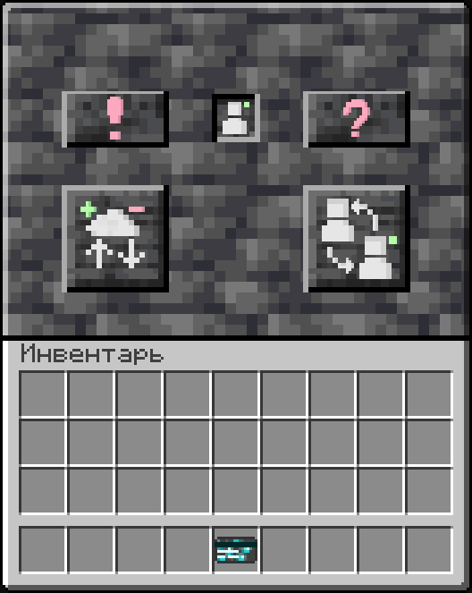
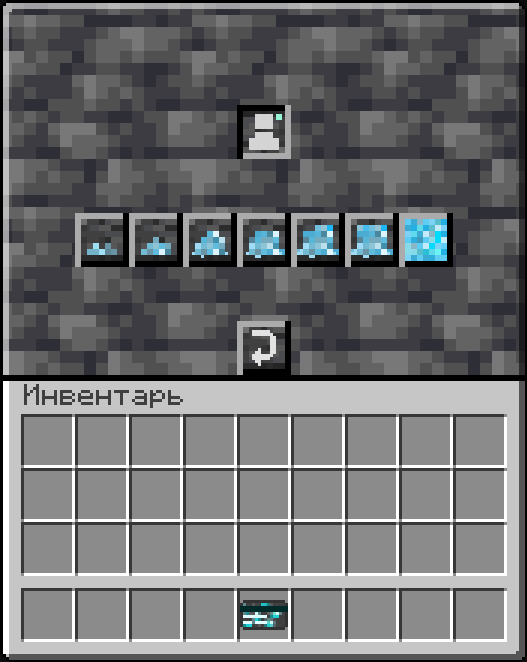
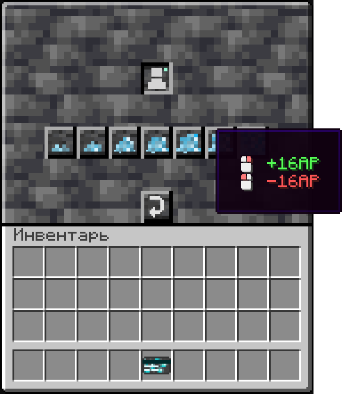
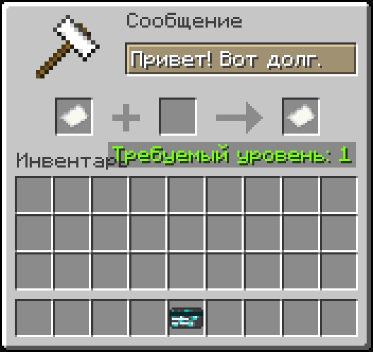

# 🏦 Банковская система

## Как открыть банк?

Чтобы открыть банк, Нажмите `ПКМ` или введите `/bank` взяв в руки карту.

<figure><figcaption></figcaption></figure>

## Как снять\пополнить счет?

В банке нажмите на кнопку с иконкой облака. Перед вами откроется меню:

<figure><figcaption></figcaption></figure>

Наведитесь на любую кнопку с изображением горстки алмазов: Вы увидите управление.

<figure><figcaption></figcaption></figure>

`ПКМ` - положит на счет выбранное количество АР, `ЛКМ` - снимет. В настройках сервера вы можете поменять управление местами.

## У меня заполнен инвентарь, но я хочу снять АРы, что будет?

АРы просто выпадут на землю под вами. Если с ними что-то случится, сервер не виноват.

## Как перевести АРы другому человеку?

Команда `/transfer` позволяет переодить валюту другим игрокам. У нее есть несколько вариаций:

```lua
- /t
- /trans
- /pay
- /p
```

Она требует 3(или 4) аргумента: ( \[] - обязательные аргументы)

```lua
/transfer [<имя_игрока>] [<сумма>] <сообщение> 
```

Если вы не указали сообщение в качестве аргумента, вам придложат написать его:

<figure><figcaption></figcaption></figure>

Укажите сообщение в графе переименования и нажмите на второй предмет(после стрелочки). Не волнуйтесь, опыт не снимется. Даже если надпись "Требуемый уровень: 1" горит красным, у вас все равно получится нажать.

## А если я не хочу писать сообщение?

Если вы не хотите отправлять перевод с прикпрепленным сообщением, в графе переименования укажите `-` (минус/тире) или просто нажмите на первый предмет(До стрелочки). Тогда, ваш перевод отправится без сообщения.

## Что за карта?

Для открытия банка необходимо взять в руки карту. Ее можно без труда создать, все рецепты можете увидеть [здесь](skiny-kart.md).

## Я перевел не тому человеку, помогите!

Просим прощения, но ничем не сможем помочь. Попросите получателя вернуть вам ту сумму. Ну а если вы ошиблись одной буквой и перевели несуществующему аккаунту АРы, то остается только грустить. Раз в несколько месяцев такие аккаунты чистятся, и вы можете написать в [тикеты](https://discord.com/channels/1220604471076323348/1224023707689681028) с просьбой вернуть их к вам на счет.&#x20;

### Я получил штраф, как его оплатить?

Команда `/myfines`

